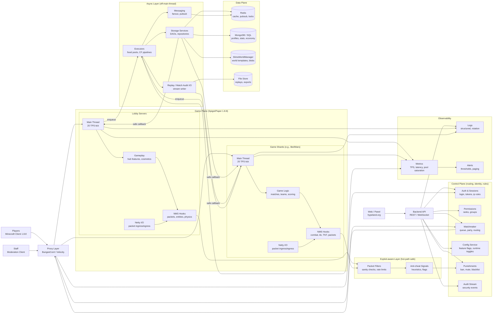

text
<h1 align="center">Nerotek01</h1>

  <em>Java engineer · Minecraft infrastructure · Founder of <a href="https://hypeland.org/">Hypeland</a></em>

  
  
  
  

---

### About

I am a Java developer who works where server internals, concurrency, and latency intersect. My specialty is the `net.minecraft.server` layer — packet interception, custom entity registration, TNT physics overrides, and low-level hooks that only make sense when you control the exact server version underneath them.

I treat performance as a design constraint, not a tuning phase. The systems I ship are built to hold thousands of concurrent players without dipping from 20 TPS, and to run for weeks without a restart. Async-first architecture, thread-isolated storage, and zero-allocation hot paths are the baseline, not the optimization.

On the side, I read exploits the way some people read documentation. Understanding how a system breaks is the only honest way to build one that does not.

---

### Architecture (Single-version, Async-first)

---

### Tech Stack

**Languages**

  
  
  
  
  
  
  
  
  
  
  
  
  

**Minecraft Ecosystem**

  
  
  
  
  
  
  
  

**Databases & Caching**

  
  
  
  
  
  
  

**Backend, Frontend & DevOps**

  
  
  
  
  
  
  
  
  
  
  

---

### How I Work

| Principle | In practice |
|---|---|
| Async by default | Storage, network, and replay I/O run on dedicated pools — the main thread never waits. |
| Single-version depth | One Minecraft version means one test surface. NMS hooks stay precise; nothing is layered behind a compatibility shim. |
| Exploit-aware design | Listeners register only for active features. Collections use `ConcurrentHashMap` with explicit cleanup. Hot paths are allocation-free. |
| Stability over scope | A server should not need a restart for weeks. Memory leaks and TPS drift are treated as bugs, not background noise. |

---

### Notable Work

- **BedWars** — a production-grade plugin for 1.8.8 networks, battle-tested at 2,000+ concurrent players. See [Nerotek01/BedWars](https://github.com/Nerotek01/BedWars).
- **Hypeland** — my reference deployment, where every change is validated under real load before it ships anywhere else. Live at [hypeland.org](https://hypeland.org/) and `mc.hypeland.org`.

---

### Contact

  
  
  

